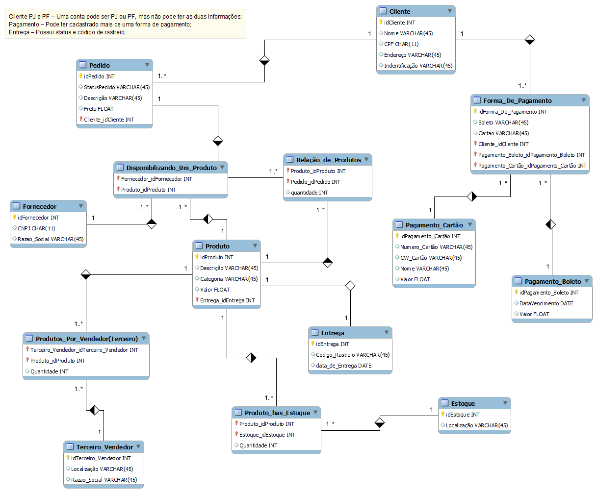

# 😎 DIO_Desafio_de_Banco_de_Dados_E-COMMERCE

## Descrição do Desafio

**O esquema deverá ser adicionado a um repositório do Github para futura avaliação do desafio de projeto. Adicione ao Readme a descrição do projeto conceitual para fornecer o contexto sobre seu esquema.**
---
## Objetivo:

Refine o modelo apresentado acrescentando os seguintes pontos:

- ✔ Cliente PJ e PF – Uma conta pode ser PJ ou PF, mas não pode ter as duas informações;
- ✔ Pagamento – Pode ter cadastrado mais de uma forma de pagamento;
- ✔ Entrega – Possui status e código de rastreio;

## Resultado da Construção do projeto Lógico 👇🏽

